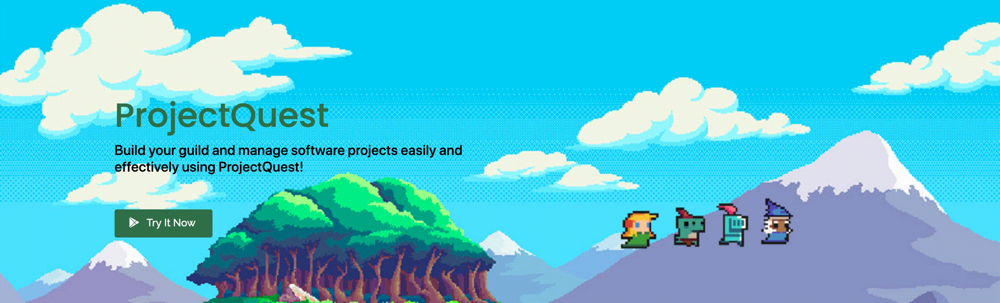

# ProjectQuest

Problem identified: During the pandemic, many companies have been forced to adopt flexible and remote working arrangements. To improve motivation among the employees, our project aims to bring RPG elements into a work productivity application specifically for Software Developers. 

Our solution: A gamified Software Project Management tool for easy remote team and task management.

## Installation

Use the package manager [pip](https://pip.pypa.io/en/stable/) to install the following libraries.

```bash
pip install flask
pip install flask_sqlalchemy
pip install flask_cors
pip install firebase_admin
```
We have included a `readme/requirements.txt` file that you can use to recursively install the necessary python libraries.

## Usage
In order to run the Web Application, first start running the `api/main.py` file 

If you are using Windows OS, you may use the following commands:
```bash
cd api/
python main.py
```

If you are using Machintosh OS, you may use the following commands:
```bash
cd api/
python main.py
```

To visit the Web Application, simply locate the folder where you've downloaded the file and add `/app` to the back of the link. For e.g. `file:///Applications/MAMP/htdocs/wad2/app`

## Demo
A live demo of our application is available at the following link: https://projectquest.netlify.app/

You may log in using the following account for a quick view of the entire Web Application:
    + email: 
    + password:

## Core Funtionalities of ProjectQuest
1. User Login & Registration
    + User Login

    + User Registration

2. Project Management
    + Auto creation or linking to Github Repo Teams
    
    + View Github statistics (daily, weekly commits, etc)

3. Task Management 
    + Creation of tasks/issues to be done
        - Assignment of team members and priority levels
        - Ability to categorize tasks/issues
    + View tasks/issues in a calendar form and Gantt chart form
    + Mark completed tasks/issues

4. Team Management
    + Create Meetings 
        - Automatically create Daily.Co (https://www.daily.co/) Meeting
        
    + View Upcoming & Past Meetings
    + Generate Meeting Invites 

5. Personal Profile Management
    + View tasks assigned to user
    + View meetings

6. Gamification elements
    + Gain EXP and Level up by completing actions 
        - Completing tasks/issues, higher priority tasks give more EXP
        - EXP Multiplier (Takes into account group streak and user level)
    + Classes
        - Mage, warrior, etc. Different looks)
    + Team-based
        - Completing tasks as a team and maintaining the team streak (which in turns affect EXP Multiplier)
    + Leaderboard within team linked with GIT
    + Redeem real life rewards based on level
        - Rewards like movie voucher created by team lead
    + Animations when completing a task 

## Contributing
Pull requests are welcome. For major changes, please open an issue first to discuss what you would like to change.

Please make sure to update tests as appropriate.

**The Team**
---

+ [@weixiangtoh](https://github.com/weixiangtoh) :whale:
+ [@nicwongg](https://github.com/nicwongg) :penguin:
+ [@tfortammi](https://github.com/tfortammi) :rabbit2:
+ [@francinetan1998](https://github.com/francinetan1998) :cat:

**Acknowledgements**
---
Our team recognises the importance of crediting our work and we would like to thank the following because if not for them, this project would not have been possible:
+ Google Gantt Chart & ChartJS for the Gantt Chart and Charts display from [Google Developers | Gantt Chart](https://developers.google.com/chart/interactive/docs/gallery/ganttchart) and [ChartJS] (https://www.chartjs.org/).
+ Full Calendar API to display calendars from [Calendar API] (https://fullcalendar.io/)
+ Canvas to create banners and character sprites from [Canvas] (https://www.canva.com/)
+ Tourguide.js to create useful tourguides for newcomers of our Web Application from [Tourguide.js] (https://github.com/LikaloLLC/tourguide.js/)
+ jQuery Datatables to add additional features to HTML tables from [jQuery Datatables] (https://datatables.net/)
+ Bootstrap 4 to incorporate responsiveness into our Web Application from [Bootstrap 4] (https://getbootstrap.com/)
+ [HZPagination.js] (https://www.jqueryscript.net/other/List-Pagination-Plugin-jQuery-HZpagination.html) to paginate lists for the rewards shop from [@ahmedhijazi94] (https://github.com/ahmedhijazi94) 
+ Pixel attack effect from [NYKNCK] (https://kvsr.itch.io/effectnpt?download)
+ Pixel icons for different reward categories from [Shikashi] (https://cheekyinkling.itch.io/shikashis-fantasy-icons-pack?download)
+ Pixel icons for different character classes from [0x72] (https://0x72.itch.io/dungeontileset-ii)
+ Pixel background art from [Sydney Seekford, Thy Vo, and Ryan Imm] (https://www.behance.net/gallery/65290819/Pixel-Art-Backgrounds-Tutorial-Skip)
+ Pixel city background art from [Ronan O'Connell] (https://www.chron.com/entertainment/article/houston-8-bit-pixel-art-skyline-reddit-scene-rice-12850623.php)
+ Pixel shop banner from [IF[ALIEN]] (https://steamcommunity.com/sharedfiles/filedetails/?id=538458906)

## License
[MIT](https://choosealicense.com/licenses/mit/)
